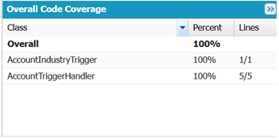

# Salesforce Apex — Account Industry Trigger

A small, fully tested Apex automation on the standard Account object, built as a Salesforce developer portfolio piece. It demonstrates the one-trigger-per-object plus handler pattern, bulk-safe logic, and a unit test with 100% code coverage.

Built and verified in a Trailhead Playground. Not connected to any production org.

## Problem

Apex triggers are easy to get wrong: business logic crammed into the trigger body, code that breaks on bulk loads of 200 or more records, and missing test coverage (Salesforce blocks deployment below 75%). The goal was to build the correct baseline shape every real trigger should follow.

## Solution

Thin trigger (AccountIndustryTrigger): a dispatcher with no logic; it only forwards Trigger.new to a handler.

Handler class (AccountTriggerHandler): all logic lives here, in a static method that takes a plain list of Account records, which makes it independently unit-testable.

Bulk-safe: the logic loops over the collection, so it handles 1 or 200 records identically, with no SOQL or DML inside the loop.

Before-save context: fields are changed in memory before the record is written, so no extra DML is needed.

Current rule: when an Account is inserted or updated with a blank Industry, the handler writes a value to the Description field.

## Tech stack

Apex (trigger, handler class, test class), SOQL, the standard Salesforce Account object, built in a Trailhead Playground via the Developer Console.

## Result

The unit test passes with zero failures and 100% code coverage (trigger 1 of 1, handler 5 of 5), past the 75% deployment threshold.

## Repository structure

The Apex files live under force-app/main/default/. The trigger is at triggers/AccountIndustryTrigger.trigger; the handler and its test are at classes/AccountTriggerHandler.cls and classes/AccountTriggerHandlerTest.cls.

## Design notes and next iteration

This began as a learning exercise. The current rule (writing a fixed string to Description when Industry is blank) is not a realistic business requirement; it is a known limitation, kept here honestly. Planned improvements: replace the hardcoded string with a configurable value, and re-base the rule on a real-world need (flag or default a field rather than overwrite a free-text field). The Salesforce metadata files (.cls-meta.xml and .trigger-meta.xml) are now included, so the project deploys cleanly via SFDX.

## What I learned

This small trigger taught me more than its size suggests:

- **`Trigger.new` and before-save context:** a trigger doesn't query the records it works on — Salesforce hands them to me in `Trigger.new`. Because I used a *before* trigger, I could set the `Description` field directly on those records and Salesforce saves it automatically, with no extra DML or SOQL.
- **Bulkification:** Salesforce can pass up to 200 records to a trigger at once, so I wrote the logic as a loop over the collection with no SOQL or DML inside it. It behaves the same for 1 record or 200 and never hits governor limits.
- **Handler pattern:** I kept the trigger as a thin dispatcher and moved the logic into a separate handler class with a static method that takes a `List<Account>`. That makes the logic reusable and, above all, testable on its own — I can pass it a list I build in a test, without needing a real DML.
- **Testing:** I wrote a unit test using Arrange-Act-Assert (set up data, run the action, check the result). `Test.startTest()/stopTest()` give the tested code a fresh set of governor limits, and `Assert.areEqual` confirms the blank-Industry account got the description while the filled one was left untouched — reaching 100% coverage (Salesforce needs 75% to deploy).
- **Real Apex gotchas I hit:** Apex only accepts single quotes for strings; an empty field is `null`, not the text `'no value'`; and a long-text field like `Description` can't be filtered in a SOQL `WHERE`.

I also set up this repository myself with Git — clone, stage, commit, push from the command line — and added the Salesforce metadata files so it deploys via SFDX.

---

Licensed under the MIT License.